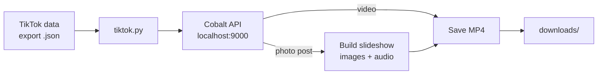

# TikTok Favorites Downloader

Download every video and photo slideshow you've ever favorited on TikTok, straight from your official data export.

[](https://www.python.org/)
[](LICENSE)
[](https://github.com/imputnet/cobalt)

TikTok lets you export your data, but that export is a JSON file full of links, not your actual videos. This tool reads that file and pulls down every favorite you have. Regular videos are saved as-is. Photo posts are rebuilt into MP4 slideshows with their original sound, so everything lands in one folder you can drop into Plex, a backup drive, or anywhere else.

Downloading runs through a self-hosted [Cobalt](https://github.com/imputnet/cobalt) instance, so your favorites never pass through a third-party server.

## Features

- **Full library export.** Reads the `FavoriteVideoList` from your TikTok data file and downloads all of it in one run.
- **Slideshow reconstruction.** Photo posts come back as separate images plus an audio track. The tool resizes and pads each image to a uniform frame, then loops the sound to match the slideshow length and encodes a single MP4. When TikTok has already deleted the original audio, it falls back to a bundled default track instead of failing.
- **Resumable.** Every finished link is written to `last_downloaded_link.txt`. If the run crashes or you stop it, the next run continues from that point instead of starting over.
- **Safe to re-run.** Output files are numbered sequentially and the tool continues from the highest existing number, so an interrupted run never overwrites what you already have. Downloads are written to a temporary `.part` file and moved into place only once complete, so a crash never leaves a half-written video behind.
- **Provenance manifest.** Every download is logged to `downloads/manifest.csv` — the output filename, its original TikTok link, whether it was a video or a slideshow, and a timestamp — so you can always tell what `147.mp4` actually is. On the first run with the manifest, it also backfills best-effort provenance for anything you'd already downloaded (mapping file `N.mp4` to the Nth link in your export; rows marked `backfilled` since failed links in past runs can shift that).
- **Retries built in.** Failed downloads retry up to five times before the tool moves on and logs the failure. The tool also checks that Cobalt is reachable before it starts, so a misconfigured instance fails fast with a clear message.

## How it works



The script sends each favorite link to your local Cobalt instance. Cobalt resolves the real media URLs and reports whether the post is a video or a photo set. Videos download directly. Photo sets get downloaded frame by frame, normalized, and encoded into a slideshow with [MoviePy](https://zulko.github.io/moviepy/).

## Prerequisites

- Python 3.9 or newer (developed on 3.12)
- A running Cobalt instance ([setup below](#setting-up-cobalt))
- FFmpeg, used by MoviePy to encode slideshows. MoviePy usually fetches it automatically via `imageio-ffmpeg`; if encoding fails, install FFmpeg and make sure it's on your `PATH`.

## Installation

```bash
git clone https://github.com/JackB296/tiktok-favorites-downloader.git
cd tiktok-favorites-downloader

python -m venv venv
source venv/bin/activate        # Windows: venv\Scripts\activate

pip install -r requirements.txt
```

## Getting your TikTok data

1. On the TikTok web app, open **Settings and privacy → Account → Download your data**.
2. Select **All data** and **JSON** as the format, then submit the request.
3. Wait for TikTok to process it (usually a few minutes), reload, and download the archive.
4. Unzip it and copy `user_data_tiktok.json` into the project directory.

If your links stop resolving partway through a run, the export can go stale. Re-download your data and try again.

## Setting up Cobalt

Cobalt discontinued its free hosted API, so you run your own instance. It's a small Node service and Cobalt maintains full [self-hosting docs](https://github.com/imputnet/cobalt/blob/main/docs/run-an-instance.md). Docker is the quickest path if you have it; the manual build below works anywhere Node 18+ runs.

1. Install [Node.js](https://nodejs.org/) 18 or newer and [pnpm](https://pnpm.io/installation).
2. Clone Cobalt and install its API dependencies:

   ```bash
   git clone https://github.com/imputnet/cobalt.git
   cd cobalt/api/src
   pnpm install
   ```

3. Create a `.env` file in that directory with:

   ```env
   API_URL=http://localhost:9000/
   ```

4. Start it:

   ```bash
   pnpm start
   ```

Leave this running in its own terminal. The API listens on `http://localhost:9000`, which is the address `tiktok.py` points at by default. Stop it with `Ctrl+C`.

> **Windows:** run Cobalt inside [WSL](https://learn.microsoft.com/en-us/windows/wsl/install) for the smoothest experience.

## Usage

With Cobalt running and `user_data_tiktok.json` in place:

```bash
python tiktok.py
```

Videos and slideshows are written to `downloads/`, numbered in order. Progress is logged to the terminal.

## Configuration

The most commonly changed settings can be passed as command-line flags instead of editing the source, e.g.:

```bash
python tiktok.py --cobalt-url http://localhost:9000/ --download-dir ~/tiktok
```

| Flag | Default | Description |
| --- | --- | --- |
| `--cobalt-url` | `http://localhost:9000/` | Address of your Cobalt instance |
| `--data-file` | `user_data_tiktok.json` | Your TikTok data export |
| `--download-dir` | `downloads` | Where finished videos are saved |
| `--retry-delay` | `0.5` | Seconds between download attempts and requests |

Run `python tiktok.py --help` to see these along with their current defaults.

For everything else, adjust these constants at the top of [`tiktok.py`](tiktok.py):

| Setting | Default | Description |
| --- | --- | --- |
| `IMG_DIR` | `img_dir` | Temporary working folder for slideshow frames |
| `LAST_DOWNLOADED_LINK_FILE` | `last_downloaded_link.txt` | Tracks the last completed link for resuming |
| `MANIFEST_FILE` | `manifest.csv` | Provenance log written inside the download directory |
| `DURATION_PER_IMAGE` | `2.5` | Seconds each photo shows in a slideshow |
| `TARGET_SIZE` | `(1280, 720)` | Frame resolution slideshow images are fit to |

The tool deletes the temporary `IMG_DIR` after each slideshow. If you'd rather keep the raw images (for example, to build your own TikTok-style viewer), remove the `shutil.rmtree(IMG_DIR)` call in `main()`.

## Troubleshooting

- **A run stopped partway.** Copy the last link from the terminal into `last_downloaded_link.txt`, then run the script again to resume from there.
- **404 errors.** Your Cobalt instance probably isn't reachable. Confirm it's running and that `COBALT_API_URL` matches its address.
- **Links won't resolve.** Re-download your TikTok data. Exports expire, and stale links are the usual cause.

## License

[MIT](LICENSE) © Jack Bialecki
