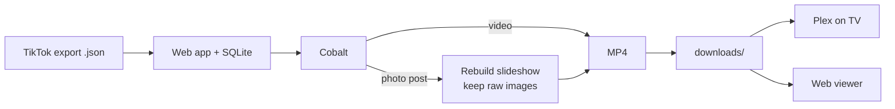

# TikTok Favorites Archive

Turn your TikTok data export into a self-hosted archive of everything you've favorited, then scroll it like TikTok itself. Videos download as-is. Photo slideshows are rebuilt into MP4s with their original sound. A local web app runs the downloads and browses the results, and Plex handles the TV.

[](https://www.python.org/)
[](https://fastapi.tiangolo.com/)
[](https://react.dev/)
[](https://www.docker.com/)
[](LICENSE)
[](https://github.com/imputnet/cobalt)

<p align="center">
  
</p>

Everything runs on your own machine through a self-hosted [Cobalt](https://github.com/imputnet/cobalt) instance, so your favorites never pass through anyone else's server.

## Quick start

You need [Docker](https://www.docker.com/).

```bash
git clone https://github.com/JackB296/tiktok-favorites-archiver.git
cd tiktok-favorites-archiver
docker compose up --build
```

Open **http://localhost:8080**. That one command starts the app and its own Cobalt instance together, so there is nothing else to install. Then:

1. Open the **Sync** tab, upload your TikTok data export (the how-to button walks you through getting it), and press Start.
2. Watch each favorite download in real time.
3. Browse them in **Feed** and **Gallery**.

Media is written to `./downloads` on your host. Point Plex at that folder and your favorites play on the TV.

## The app

**Feed.** A vertical scroll of your favorites, one at a time. Videos autoplay as they come into view and expose play/pause and seeking controls on hover. Photo posts use a manual image carousel while their original audio keeps playing; slides never advance on their own. Opens at your newest favorite, remembers where you left off ("go to last watched"), and has a no-repeat shuffle mode. Desktop controls are built in: arrow keys change favorites, Space pauses, M toggles sound, and F enters or exits fullscreen; the on-screen keyboard button shows the same list. The next eight posts preload, and the previous video stops as soon as navigation begins, so the Feed stays responsive at 11,000+ favorites. Optional automatic loudness leveling is capped at 2.5× to avoid distorted amplification.

**Gallery.** A comfortable thumbnail grid of everything, searchable by caption, hashtag, or author (pulled from TikTok's public oEmbed data), ranked best-match first. Beyond the basic All / Videos / Slideshows filter there's a full advanced panel — date range, duration, file size, resolution, orientation, codec, download status, download-attempt range, include/exclude author or tag lists, eleven repeatable sort orders (including missing audio first, creator A–Z, and recent download attempts) plus a fresh random shuffle. Confirmed silent videos are marked on their cards and in Feed. This makes it easy to isolate broken media or stubborn failures for recovery. Each Feed post has a settings button where its local MP4, custom JPEG/PNG/WebP thumbnail, or both can be replaced without changing its archive number, caption, creator, or source link; the previous video is kept in `downloads/.archive/replaced/` so a mistaken upload can be undone by hand. The one-click **Recovery** inbox first refreshes archive integrity, then shows failed downloads, scan-confirmed missing finished files, and untouched pending favorites; it can be saved or shared like every other Gallery filter. Save any full combination as a named preset or share it as a copyable link. Save reusable author/hashtag whitelist or blacklist lists too — for example, “No FYP” or “Gaming” — then apply them without replacing terms already entered. Inspect mode opens a favorite’s full archive metadata, including retry count and last attempt time, without leaving the grid. Select up to 100 favorites to start a temporary custom Feed queue, save it as a named queue for later, or target recovery. Failed favorites show their last error. As you browse, it loads the next page near the end of the current results and keeps only viewport-adjacent thumbnail rows mounted, so an 11,000-favorite library stays responsive.

**Sync.** The control center. Upload your export, then start, pause, resume, or stop a run and watch per-item status update live over Server-Sent Events. It also keeps a durable local history of recent archive jobs and their final counts. The tab houses the library settings: Gallery indexing (thumbnails + media facts, with a quality choice), Sync worker count, a portable archive-inventory CSV, media-server metadata export, and an archive integrity check.

<p align="center">
  
</p>

## How it works



The app reads your export, records every favorite in a SQLite database, and works through them with a bounded pool of workers that stays under Cobalt's rate limit. Cobalt resolves each link to real media. Videos download directly. For a photo post, the images and audio are downloaded, rebuilt into a slideshow MP4 (each image centered on a black canvas sized to the largest image, with no downscaling), and the raw images are kept so the web viewer can render them as a carousel.

File numbering is stable: `147.mp4` remains archive item 147 in the database. Favorite chronology is stored separately, so a legacy migration can preserve old filenames without making Feed order incorrect. A rerun never renumbers or overwrites what you already have, and Plex keeps its place.

## Details worth knowing

- **Resumable and crash-safe.** Progress lives in SQLite, so a rerun knows exactly which favorites still need work. Downloads stream to a `.part` file and are renamed into place only once complete, so a crash never leaves a half-written video behind.
- **Dead links stay meaningful.** When TikTok reports that an original post is gone, the favorite becomes an unavailable archive marker instead of a recurring failure. Its number and position remain visible in Feed and Gallery, and automatic Sync runs do not retry it.
- **Original slideshow audio.** Photo posts request the full original sound. If TikTok has already deleted it, a bundled default track fills in instead of failing the encode.
- **Backfill.** Already downloaded favorites before this existed? The Sync tab's Backfill re-fetches the raw slideshow images for your existing files so they render in the viewer.
- **Rate-limit aware.** The worker pool backs off on HTTP 429 and holds a configurable request rate, so a self-hosted Cobalt is not overwhelmed.
- **Provenance.** `downloads/manifest.csv` maps each file to its source link, type, and status alongside the database.
- **Gallery index.** Sync automatically records duration, dimensions, codec, file size, and whether an audio stream exists, then renders a WebP thumbnail per favorite (480px or 320px, your choice), so the Gallery pages instantly instead of decoding video. Indexing runs on a small worker pool and can be rebuilt, paused, or turned off in the Sync tab.
- **Search metadata.** The Sync tab can fetch missing captions and creator names from TikTok's public oEmbed endpoint. It runs at the configured rate limit, skips entries already enriched, and can be paused or stopped; this powers complete author, hashtag, and caption search.
- **Random Gallery order.** Random mode makes a new shuffle whenever you enter it, as intended; use a saved filter or a shared link for repeatable searches and sorts.
- **Media-server metadata.** One click writes a `.nfo` title file and `.jpg` poster next to every video — Plex, Jellyfin, and Kodi show real titles and artwork instead of bare numbers. Your media files are never modified.
- **Integrity check.** The Sync tab can verify the whole archive: finished favorites missing their video (one click re-queues them), stray files no favorite claims, and leftover temp files from interrupted runs.
- **Localhost only.** The app has no login, so Docker binds it to `127.0.0.1` — nothing else on your network can reach it. Plex reads `./downloads` from disk and is unaffected.
- **Backups.** Two things hold your archive: the media in `./downloads` and the database at `./appdata/archive.db` (numbering, statuses, captions, saved filters). Copy both while the app is stopped and you can restore everything.

## Architecture

```
core/     download engine: export parsing, Cobalt client, slideshow encoder,
          SQLite store, concurrent sync, oEmbed enrichment, asset backfill
server/   FastAPI backend: REST + Server-Sent Events, background job manager,
          range-capable media streaming
web/      React + Vite + Tailwind SPA: Feed, Gallery, Sync
Dockerfile + docker-compose.yml   the app plus an official Cobalt image
```

The download engine is a standalone Python package with no web dependency, covered by a unit-test suite (run with `for f in tests/test_*.py; do python3 "$f"; done`). The backend wraps it with job control and live progress. The frontend talks to a small typed API and never reaches Cobalt directly.

## Configuration

With Docker, set these on the `app` service in `docker-compose.yml`:

| Variable | Default | Purpose |
| --- | --- | --- |
| `COBALT_API_URL` | `http://cobalt:9000/` | Address of the Cobalt service |
| `DOWNLOAD_DIR` | `/app/downloads` | Where media is saved |
| `CONCURRENCY` | `4` | Simultaneous downloads |
| `RATE_MAX_CALLS` / `RATE_PERIOD` | `8` / `1.0` | Requests allowed per window, in seconds |
| `DB_FILE` | `/app/data/archive.db` | Path of the SQLite archive database |
| `APP_PORT` | `8080` | Port the web app listens on |

If you raise the concurrency and rate, raise Cobalt's `RATELIMIT_MAX` and `RATELIMIT_WINDOW` in the same file to match. If you change `APP_PORT`, update the `ports:` mapping too.

## Getting your TikTok data

1. In TikTok, open **Settings and privacy → Account → Download your data**.
2. Choose **All data** and the **JSON** format, then submit the request.
3. When TikTok has prepared it, download and unzip the archive.
4. Upload `user_data_tiktok.json` in the Sync tab.

Exports expire. If links stop resolving partway through a run, request a fresh one.

## Upgrading an archive made by the original CLI

Use the guarded legacy bootstrap if you have numbered MP4s and
`last_downloaded_link.txt`, but no `downloads/manifest.csv` or established
`appdata/archive.db`. It is designed for an unavailable NAS: only the numeric
MP4s currently in `downloads` are required.

On Windows, install and start Docker Desktop first. In GitHub Desktop, fetch
and pull the latest code, then open PowerShell in the repository folder:

```powershell
docker compose down
Test-Path '.\downloads'
Get-ChildItem '.\downloads' -Filter '*.mp4' -File | Select-Object -First 5 Name
Test-Path '.\last_downloaded_link.txt'
Get-ChildItem '.\appdata' -Force -ErrorAction SilentlyContinue
```

Bootstrap deliberately requires a database with no favorite rows. If
`appdata` contains an earlier test database, preserve the whole directory and
start with a new one; do not delete it:

```powershell
if (Test-Path '.\appdata') {
    $backup = ".\appdata-before-legacy-$((Get-Date).ToString('yyyyMMdd-HHmmss'))"
    Rename-Item '.\appdata' $backup
}
New-Item -ItemType Directory -Force '.\appdata'
docker compose up --build -d
```

Open **http://localhost:8080 → Sync → First-time setup from the old CLI** and
choose:

1. **Old export:** the `user_data_tiktok.json` used by the final CLI run.
2. **Current export:** the newest `user_data_tiktok.json` containing the new favorites.
3. **Checkpoint:** the old `last_downloaded_link.txt`.

Press **Preview mapping**. Nothing is written during preview. Check the
inferred offset, local filename range, gap count, number of new downloads, and
several sample link-to-file mappings. Apply is enabled only after you confirm
the samples. Apply writes one atomic SQLite transaction and does not rename,
delete, move, index, or download any media.

If the original CLI was restarted and its numbering changed, use **Mapping
segments** before preview. Enter comma-separated `first-file:offset` pairs.
For example, `20968:5833, 22315:5832` means files #20,968–#22,314 use offset
5,833 and files from #22,315 onward use 5,832. Preview shows each resulting
file and export-position range separately. Any favorite consumed by a failed
run and then hidden by a reused filename is preserved as its own ignored
position marker.

After it succeeds, the result explains how many local files were matched, how
many failed legacy filename slots were preserved, how many inaccessible older
favorites were marked offloaded, and how many truly new favorites are pending.
Only then press **Start sync**. Gallery indexing can run with Sync or be rebuilt
later; it is not part of the migration.

Pulling code through GitHub Desktop does not touch `downloads`, `appdata`, the
export JSON, or `last_downloaded_link.txt`: all are git-ignored local data. The
Docker Compose bind mounts use those same folders on the host, so rebuilding
the image does not copy the media into Docker or erase it.

## Headless archive command

<details>
<summary>Run the Archive without the web app</summary>

The headless Archive command needs its own Cobalt instance (see Cobalt's [run-an-instance guide](https://github.com/imputnet/cobalt/blob/main/docs/run-an-instance.md)) and Python 3.9+ with FFmpeg on your `PATH`.

```bash
python -m venv venv && source venv/bin/activate   # Windows: venv\Scripts\activate
pip install -r requirements.txt
python -m core sync --data-file user_data_tiktok.json
```

Flags: `--cobalt-url`, `--data-file`, `--download-dir`, `--db`, `--concurrency`. Run `python -m core sync --help` for the defaults.

</details>

## Development

Backend tests are stdlib-only — no dependencies to install:

```bash
for f in tests/test_*.py; do python3 "$f"; done
```

The web app needs Node 20.19+ (see `web/.nvmrc`). `npm run dev` serves the SPA with hot reload and proxies `/api` and `/media` to a backend on `localhost:8080`, so start the Docker app (or `uvicorn server.main:app`) first:

```bash
cd web
npm ci
npm run dev     # SPA on http://localhost:5173, API proxied to :8080
npm run build   # type-check + production bundle
```

## Built with

Python · FastAPI · SQLite · MoviePy · React · Vite · TypeScript · Tailwind CSS · Docker · [Cobalt](https://github.com/imputnet/cobalt)

## Disclaimer

Not affiliated with, endorsed by, or sponsored by TikTok or ByteDance Ltd. "TikTok" is a trademark of its respective owner and is used here only to describe what this tool works with.

This is a tool for **privately archiving your own favorited content** from the data export TikTok provides to you. It runs entirely on your own machine — nothing you import or download is sent to any external service or to the author. You are responsible for complying with [TikTok's Terms of Service](https://www.tiktok.com/legal/) and with the copyright of the original creators; keep downloaded media for personal use and don't redistribute it. The software is provided "as is", without warranty, under the [MIT License](LICENSE).

## License

[MIT](LICENSE) © Jack Bialecki
