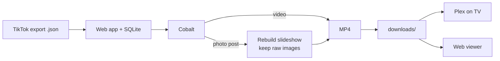

# TikTok Favorites Archive

Turn your TikTok data export into a self-hosted archive of everything you've favorited, then scroll it like TikTok itself. Videos download as-is. Photo slideshows are rebuilt into MP4s with their original sound. A local web app runs the downloads and browses the results, and Plex handles the TV.

[](https://www.python.org/)
[](https://fastapi.tiangolo.com/)
[](https://react.dev/)
[](https://www.docker.com/)
[](LICENSE)
[](https://github.com/imputnet/cobalt)

<p align="center">
  
</p>

Everything runs on your own machine through a self-hosted [Cobalt](https://github.com/imputnet/cobalt) instance, so your favorites never pass through anyone else's server.

## Quick start

You need [Docker](https://www.docker.com/).

```bash
git clone https://github.com/JackB296/tiktok-favorites-archiver.git
cd tiktok-favorites-archiver
docker compose up --build
```

Open **http://localhost:8080**. That one command starts the app and its own Cobalt instance together, so there is nothing else to install. Then:

1. Open the **Sync** tab, upload your TikTok data export (the how-to button walks you through getting it), and press Start.
2. Watch each favorite download in real time.
3. Browse them in **Feed** and **Gallery**.

Media is written to `./downloads` on your host. Point Plex at that folder and your favorites play on the TV.

## The app

**Feed.** A vertical scroll of your favorites, one at a time. Videos autoplay as they come into view; photo posts play as an image carousel with their original audio.

**Gallery.** A thumbnail grid of everything, searchable by caption, hashtag, or author (pulled from TikTok's public oEmbed data), with filters by type.

**Sync.** The control center. Upload your export, then start, pause, resume, or stop a run and watch per-item status update live over Server-Sent Events.

<p align="center">
  
</p>

## How it works



The app reads your export, records every favorite in a SQLite database, and works through them with a bounded pool of workers that stays under Cobalt's rate limit. Cobalt resolves each link to real media. Videos download directly. For a photo post, the images and audio are downloaded, rebuilt into a slideshow MP4 (each image centered on a black canvas sized to the largest image, with no downscaling), and the raw images are kept so the web viewer can render them as a carousel.

File numbering is stable: `147.mp4` is item 147 in the database. A rerun never renumbers or overwrites what you already have, and Plex keeps its place.

## Details worth knowing

- **Resumable and crash-safe.** Progress lives in SQLite, so a rerun knows exactly which favorites still need work. Downloads stream to a `.part` file and are renamed into place only once complete, so a crash never leaves a half-written video behind.
- **Original slideshow audio.** Photo posts request the full original sound. If TikTok has already deleted it, a bundled default track fills in instead of failing the encode.
- **Backfill.** Already downloaded favorites before this existed? The Sync tab's Backfill re-fetches the raw slideshow images for your existing files so they render in the viewer.
- **Rate-limit aware.** The worker pool backs off on HTTP 429 and holds a configurable request rate, so a self-hosted Cobalt is not overwhelmed.
- **Provenance.** `downloads/manifest.csv` maps each file to its source link, type, and status alongside the database.

## Architecture

```
core/     download engine: export parsing, Cobalt client, slideshow encoder,
          SQLite store, concurrent sync, oEmbed enrichment, asset backfill
server/   FastAPI backend: REST + Server-Sent Events, background job manager,
          range-capable media streaming
web/      React + Vite + Tailwind SPA: Feed, Gallery, Sync
Dockerfile + docker-compose.yml   the app plus an official Cobalt image
```

The download engine is a standalone Python package with no web dependency, covered by a unit-test suite (run with `python3 tests/test_*.py`). The backend wraps it with job control and live progress. The frontend talks to a small typed API and never reaches Cobalt directly.

## Configuration

With Docker, set these on the `app` service in `docker-compose.yml`:

| Variable | Default | Purpose |
| --- | --- | --- |
| `COBALT_API_URL` | `http://cobalt:9000/` | Address of the Cobalt service |
| `DOWNLOAD_DIR` | `/app/downloads` | Where media is saved |
| `CONCURRENCY` | `4` | Simultaneous downloads |
| `RATE_MAX_CALLS` / `RATE_PERIOD` | `8` / `1.0` | Requests allowed per window, in seconds |

If you raise the concurrency and rate, raise Cobalt's `RATELIMIT_MAX` and `RATELIMIT_WINDOW` in the same file to match.

## Getting your TikTok data

1. In TikTok, open **Settings and privacy → Account → Download your data**.
2. Choose **All data** and the **JSON** format, then submit the request.
3. When TikTok has prepared it, download and unzip the archive.
4. Upload `user_data_tiktok.json` in the Sync tab.

Exports expire. If links stop resolving partway through a run, request a fresh one.

## Headless CLI

<details>
<summary>Run the downloader without the web app</summary>

The original command-line downloader still ships in the repo. It needs its own Cobalt instance (see Cobalt's [run-an-instance guide](https://github.com/imputnet/cobalt/blob/main/docs/run-an-instance.md)) and Python 3.9+ with FFmpeg on your `PATH`.

```bash
python -m venv venv && source venv/bin/activate   # Windows: venv\Scripts\activate
pip install -r requirements.txt
python tiktok.py --data-file user_data_tiktok.json
```

Flags: `--cobalt-url`, `--data-file`, `--download-dir`, `--retry-delay`. Run `python tiktok.py --help` for the defaults.

</details>

## Built with

Python · FastAPI · SQLite · MoviePy · React · Vite · TypeScript · Tailwind CSS · Docker · [Cobalt](https://github.com/imputnet/cobalt)

## Disclaimer

Not affiliated with, endorsed by, or sponsored by TikTok or ByteDance Ltd. "TikTok" is a trademark of its respective owner and is used here only to describe what this tool works with.

This is a tool for **privately archiving your own favorited content** from the data export TikTok provides to you. It runs entirely on your own machine — nothing you import or download is sent to any external service or to the author. You are responsible for complying with [TikTok's Terms of Service](https://www.tiktok.com/legal/) and with the copyright of the original creators; keep downloaded media for personal use and don't redistribute it. The software is provided "as is", without warranty, under the [MIT License](LICENSE).

## License

[MIT](LICENSE) © Jack Bialecki
