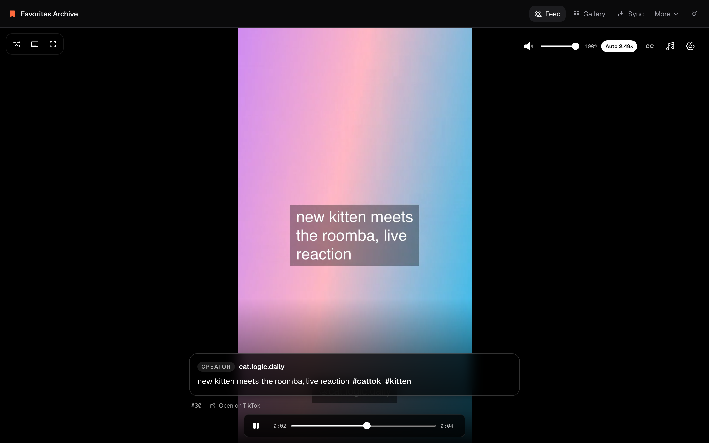
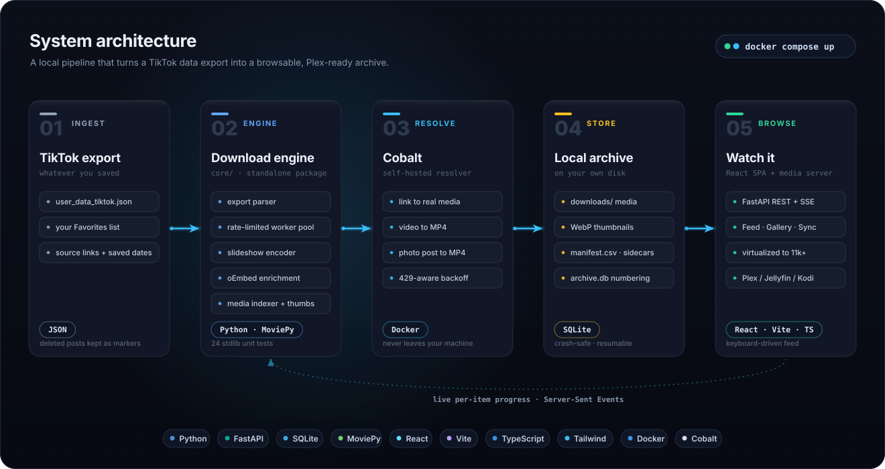
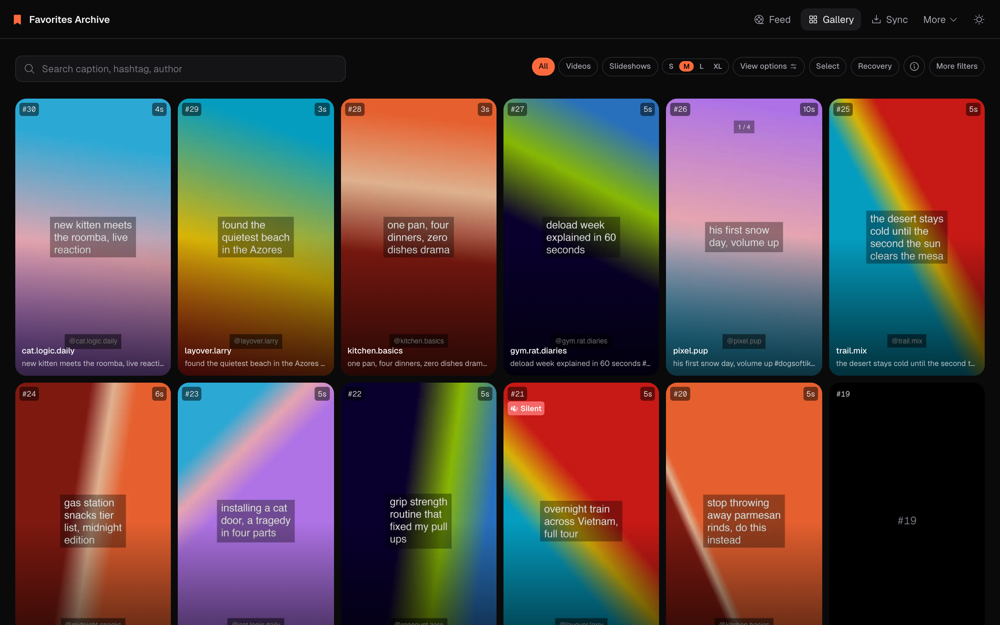
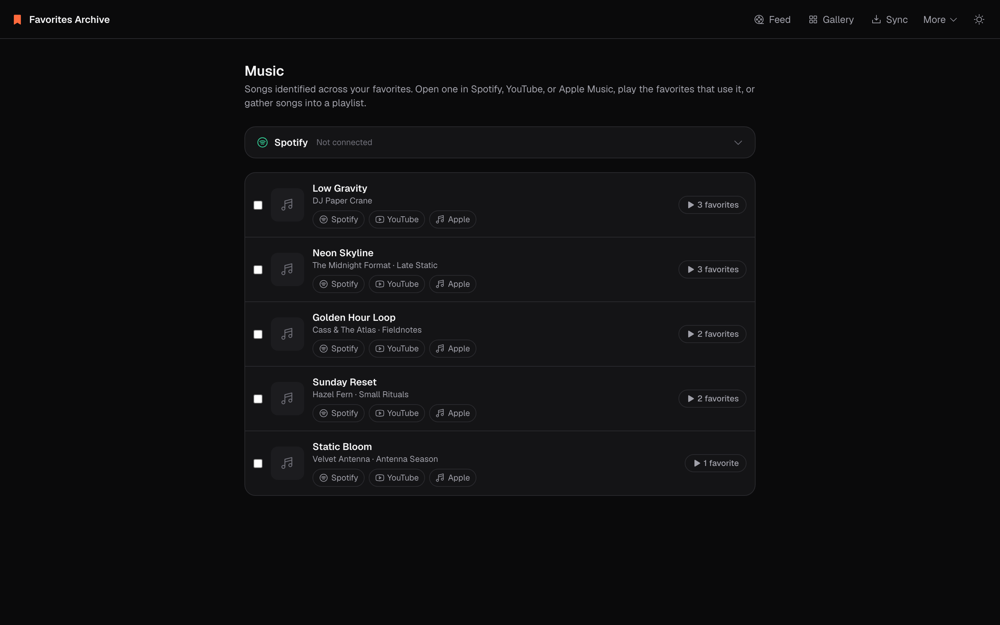
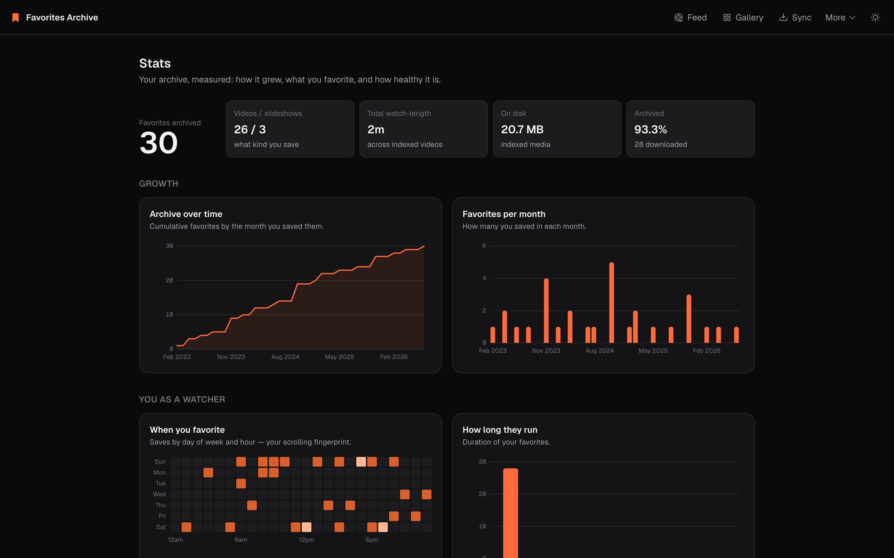
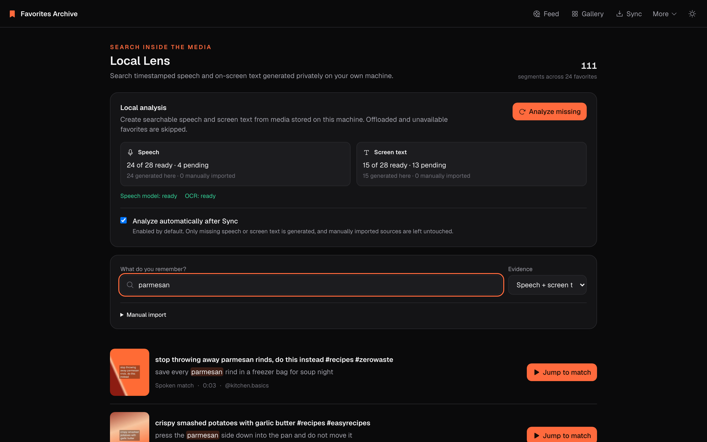
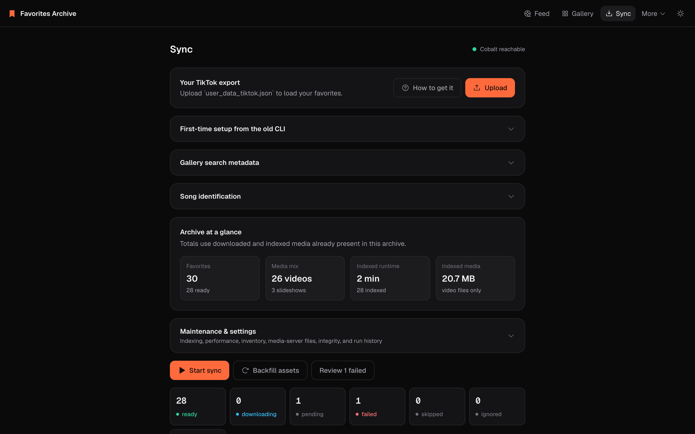

<h1 align="center">TikTok Favorites Archive</h1>

<p align="center">
  Turn your TikTok data export into a self-hosted archive of everything you've favorited, then scroll it like TikTok itself.
</p>

<p align="center">
  <a href="https://www.python.org/"></a>
  <a href="https://fastapi.tiangolo.com/"></a>
  <a href="https://react.dev/"></a>
  <a href="https://www.typescriptlang.org/"></a>
  
  <a href="https://www.docker.com/"></a>
  <a href="https://github.com/JackB296/tiktok-favorites-archiver/actions/workflows/ci.yml"></a>
  <a href="LICENSE"></a>
</p>

<p align="center">
  
  <br>
  <sub>All screenshots show a synthetic demo archive — generated gradients and made-up creators, no real TikTok content.</sub>
</p>

Videos download as-is. Photo slideshows are rebuilt into MP4s with their original sound. A local web app runs the downloads and browses the results, and Plex handles the TV. Cobalt remains the default resolver, while a bundled `yt-dlp` path can recover failed or silent videos and source metadata. Both run inside your own app stack; only TikTok's public endpoints are contacted for media and source details.

## Architecture

<p align="center">
  
</p>

The app reads your export, records every favorite in a SQLite database, and works through them with a bounded pool of workers that stays under Cobalt's rate limit. Cobalt resolves each link to real media. For video posts the archive validates the result and uses `yt-dlp` when Cobalt fails, the file is silent, or a better usable rendition is available. When TikTok exposes a silent high-resolution rendition and a synchronized lower-resolution rendition with sound, the archive stream-copies the higher-resolution video and muxes in the verified audio; if that repair is unsafe, the audible rendition remains the fallback. A photo post has its images and audio downloaded, rebuilt into a slideshow MP4 (each image centered on a black canvas sized to the largest image, with no downscaling), and its raw images kept so the web viewer can render them as a carousel.

File numbering is stable: `147.mp4` stays archive item 147 in the database. Favorite chronology is stored separately, so a legacy migration can preserve old filenames without making Feed order wrong. A rerun never renumbers or overwrites what you already have, and Plex keeps its place.

For the proposed next-generation queue, resource limits, quiet hours, cancellation, and crash-recovery model, see [Background job controls](BACKGROUND_JOBS.md).

## Highlights

- **Runs entirely on your machine.** The app and its own Cobalt resolver come up together with one `docker compose up`. Nothing you import or download touches a third-party server.
- **Resilient download engine.** A bounded worker pool holds a configurable request rate and backs off on HTTP 429. Progress lives in SQLite, downloads stream to a `.part` file and are renamed into place only when complete, and a rerun resumes exactly where it stopped.
- **Rebuilds photo slideshows.** TikTok photo posts are re-encoded into MP4s with their original audio (FFmpeg via MoviePy), with the raw images kept for the in-app carousel.
- **Scales to a real library.** The Feed and Gallery stay responsive at 11,000+ favorites through row virtualization, media preloading, and range-based streaming from the backend.
- **Searches inside the videos.** Local Lens generates timestamped speech transcripts and on-screen text with bundled, CPU-only tools (whisper.cpp and Tesseract, in the container), then jumps straight to the matching moment. Nothing is sent to a hosted service.
- **More than a folder of MP4s.** Stats charts your favoriting habits, Discover browses by creator and hashtag, Memories resurfaces old saves, Curate adds private stars/tags/notes, Vibes finds similar posts with a local text embedding, Duplicates reports byte-identical files, and Channels turn saved searches into continuous feeds. All of it computed locally from data already on disk.
- **Owns backup and storage.** Mounted folders or NAS shares with previewed, checksummed copy/move/restore, plus portable archive snapshots with guarded rollback.
- **Built to be operated.** Live per-item progress over Server-Sent Events, daily/weekly scheduled runs, an integrity check, a one-click recovery inbox, and a CSV inventory.
- **Identifies songs (opt-in, off by default).** Shazam names each favorite's track; the Music tab collects them, opens them in your music service, and can push playlists to your own Spotify account. Enabling it is the only time audio leaves your machine.
- **Tested.** The download engine is a standalone Python package with a stdlib-only unit suite; the SPA has behavior tests over its logic modules; CI runs both plus a full image build.

## Quick start

You need [Docker](https://www.docker.com/).

```bash
git clone https://github.com/JackB296/tiktok-favorites-archiver.git
cd tiktok-favorites-archiver
docker compose up -d
```

Open **http://localhost:8080**. That pulls the prebuilt image from GHCR and starts the app and its own Cobalt instance together, so there is nothing else to install or compile. (Prefer to build from source? `docker compose -f docker-compose.yml -f docker-compose.build.yml up --build -d`.) Then:

1. Open the **Sync** tab, upload your TikTok data export (the how-to button walks you through getting it), and press Start.
2. Watch each favorite download in real time.
3. Browse them in **Feed** and **Gallery**.

Media is written to `./downloads` on your host. Point Plex at that folder and your favorites play on the TV.

The whole first run, in 30 seconds:

<p align="center">
  
</p>

Running **Unraid, CasaOS, or Umbrel**? Ready-made install templates with per-platform steps live in [templates/](templates/).

## The app

### Feed

A vertical scroll of your favorites, one at a time. Videos autoplay as they come into view and expose play/pause and seeking controls on hover. Photo posts use a manual image carousel while their original audio keeps playing; slides never advance on their own. An identified song links to an exact Gallery of every archived post using it, with a separate shortcut to open the track online. A comments button opens saved public comments and replies without leaving playback, and a per-post button lets you search for and set the song by hand.

It opens at your newest favorite, remembers where you left off ("go to last watched"), and has a no-repeat shuffle. Desktop controls are built in: arrow keys change favorites, Space pauses, M toggles sound, F enters or exits fullscreen. The next eight posts preload and the previous video stops the moment navigation begins, so the Feed stays smooth at 11,000+ favorites. Optional loudness leveling is capped at 2.5× to avoid distorted amplification.

### Gallery

<p align="center">
  
</p>

A searchable thumbnail grid of everything, ranked best-match first.

- **Search and filter.** Post search still defaults to captions, descriptions, creators, hashtags, and source links. The **Search in** control can instead target locally saved comments and usernames, identified songs and artists, Local Lens transcripts/OCR, or every local index together. Beyond All / Videos / Slideshows, the advanced panel covers favorite and original upload dates, engagement counts, source/comment availability, downloader, portable metadata, duration, file size, resolution, orientation, codec, download status, and attempt count, plus include/exclude creator and tag lists, eleven repeatable sort orders, and a fresh random shuffle.
- **Smart collections and lists.** Save any filter combination as a named Smart collection or share it as a copyable link. Membership is resolved live whenever you open, play, export, or bulk-mark it. Save reusable author/hashtag allow or deny lists (for example "No FYP" or "Gaming") and apply them without clearing terms already entered. Playback queues remain fixed snapshots of the IDs you selected.
- **Recovery and repair.** The one-click Recovery inbox refreshes archive integrity, then surfaces failed downloads, scan-confirmed missing files, and untouched pending favorites. Confirmed-silent videos are flagged on their cards and in Feed. Each post can have its local MP4, thumbnail, or both replaced without changing its archive number, caption, creator, or source link; the previous file is kept in `downloads/.archive/replaced/` so a mistaken upload can be undone.
- **Queues and inspect.** Select up to 100 favorites to start a temporary custom Feed queue, save it as a named queue, or target recovery. Inspect mode opens a favorite's full archive metadata, including retry count and last attempt time, without leaving the grid. Failed favorites show their last error.
- **Performance and previews.** The first page starts loading immediately, later pages arrive near the end of the current results, and only viewport-adjacent thumbnail rows stay mounted. **Hover previews** are on by default in a fresh browser: rest the pointer on a video for about 250 ms to play one muted six-second sample in its card. The toolbar toggle remembers an explicit off choice per browser. Moving away tears the video down, and the Gallery never loads more than one preview at a time.

### Music

<p align="center">
  
</p>

Every identified song collects here, most-used first. Each track shows how many favorites use it, opens in Spotify, YouTube, or Apple Music, can start a Feed of exactly the favorites that share it, and can open the same set as a browseable Gallery. Tick songs to save a named playlist. The tab is empty until you enable song identification in Sync and run it.

Connect your own Spotify account (a free developer app's Client ID, one-time) and each saved playlist gains a push button that creates it as a private Spotify playlist, matching each song by its stored link or a search. Pushing again updates the same playlist instead of duplicating, and the app reports exactly which songs it could not confidently match. Nothing reaches Spotify until you connect and press push.

### Stats

<p align="center">
  
</p>

A read-only dashboard over data the archive already has. A summary strip (total favorites, video/slideshow mix, total watch-length, disk usage, percent archived) leads into four sections: **Growth** (cumulative favorites and per-month saves), **You as a watcher** (a day-of-week × hour favoriting heatmap, a duration histogram with your median, and the confirmed-silent share), **Top of your archive** (most-favorited creators, most-used songs, and top hashtags, each linking into a filtered Gallery), and **Archive health** (a lifecycle donut and the most common failure reasons). Favorites without a saved date sit out of the time charts and are disclosed, never guessed.

### Discover

Creators and Hashtags become first-class, Unicode-normalized identities. Discover searches and orders both sets by name, use count, or recent activity, then opens an exact Gallery or Feed selection—`@ann` never accidentally includes `@anna`. Existing caption and author fields remain available while an automatic, resumable backfill upgrades older databases.

### Local Lens

<p align="center">
  
</p>

Local Lens searches inside a favorite instead of only searching its caption.
The official Docker image includes `whisper.cpp` with the multilingual base
model for speech and Tesseract with English data for text visible in frames.
Both run inside the app container. No media, extracted audio/frame, transcript,
or OCR result is sent to a hosted analysis service.

Local analysis is enabled after Sync by default. New downloads are analyzed
automatically, and **Analyze missing** backfills every eligible MP4 already on
disk. Favorites marked offloaded, missing, or unavailable are skipped even when
a NAS is mounted; the app never restores them just to analyze them. Speech and
screen text complete independently, so a failure in one does not discard the
other, and successful empty results are remembered. The run can be paused,
continued, or stopped from Local Lens.

Transcript segments can also appear as timed captions over Feed videos. Use the
**CC** control to show or hide them; captions start off in a fresh browser and
the choice is remembered on that browser. Only transcript segments are
displayed. OCR stays searchable in Local Lens and is never placed over the
video.

The earlier JSON workflow remains under the closed **Manual import** section.
It is intentionally small and tool-neutral:

```json
{
  "items": [
    {
      "item_id": 147,
      "segments": [
        {
          "source": "transcript",
          "text": "Press the parmesan side down.",
          "start_s": 18.2,
          "end_s": 22.7
        },
        {
          "source": "ocr",
          "text": "400°F · 20 minutes",
          "start_s": 23,
          "end_s": null
        }
      ]
    }
  ]
}
```

`source` must be `transcript` or `ocr`; times are finite non-negative seconds. A
document can contain up to 5,000 favorites and 100,000 total segments within the
64 MB upload limit. The complete document is validated before any indexed text
changes. Imported sources are authoritative and automatic analysis never
overwrites them; an omitted source remains eligible for local generation.

The bundled base model adds about 142 MiB to the image and uses roughly 388 MB
of memory while loaded. Analysis is CPU-intensive and deliberately processes
one favorite at a time. Long initial backfills can run for hours or days,
depending on the archive and CPU; pause or stop them at any time without losing
completed work.

### Memory Lane and Archive Time Machine

Memory Lane creates three private daily shelves from local metadata: favorites saved on this date in earlier years, never or least-recently played favorites, and more finds from the current month's archives. A shelf opens as a fixed Feed queue. The only new activity it records is which favorite becomes active in the local Feed; no watch history leaves the SQLite database.

Every successful export upload also becomes an immutable Time Machine checkpoint. History compares it with the immediately previous upload and reports new, missing, unchanged, and missing-but-safely-archived favorites. "Missing" only describes the newer TikTok export. It never deletes, renumbers, or changes an existing archive item.

### Curator Deck, Vibe Atlas, Duplicate Radar, and Channels

Curator Deck runs short review sessions over unreviewed or least-recently
watched favorites. A review can star the favorite, attach up to 20 private
tags, and save a private note. The Gallery advanced panel can then show only
starred favorites or one exact private tag.

Vibe Atlas builds a sparse text embedding at query time from archive captions,
creators, hashtags, identified songs, Local Lens transcripts, and OCR. Search
results explain their strongest shared terms, and any result can seed a
"find similar" pass. The implementation is deterministic, standard-library
only, and local.

Duplicate Radar hashes finished local MP4s in bounded chunks. A cheap size and
modification-time fingerprint lets later scans reuse unchanged SHA-256
digests. Reports are read-only: they show exact byte-identical groups and
potential reclaimable space, while all cleanup decisions remain manual.

Archive Channels are named, live views over Gallery Smart Collections.
Launching one uses the normal Feed, disables per-item looping, and advances
when video or slideshow audio ends. A channel can keep collection order,
shuffle, and place never-watched favorites first. Deleting a channel never
deletes its Smart Collection or media.

### Storage and Backups

Storage locations are folders already mounted on the app machine, such as an external drive or NAS bind mount. The app validates that a location is mounted, writable, and outside the active downloads/database paths. Copy and Move always show a read-only preview; both checksum every durable media file before recording a verified placement, and Move deletes local files only after that record is safely persisted. Restore verifies the external copy, recreates local media, and leaves the external copy intact. Legacy rows previously marked Offloaded remain visible but are not claimed as verified until managed storage has evidence for them.

Backups creates a versioned `.tiktok-archive` directory. Metadata snapshots contain a consistent SQLite online backup; complete snapshots add media. Both use sorted relative-path manifests and SHA-256 checksums, publish atomically after validation, and resume partial work. Replacing a non-empty Archive requires typing `REPLACE ARCHIVE` and creates a rollback snapshot first.

### Sync

The control center. Upload your export, then start, pause, resume, or stop a run
and watch per-item status update live over Server-Sent Events. It keeps a
durable phase timeline and retry ancestry. You can enable and reorder supported
post-Sync phases without changing the default
(`Sync → Search metadata → Song identification → Local analysis`), and create
daily or weekly schedules with an explicit IANA timezone. Schedules run only
while the app is running, defer while another Archive job is active, and catch
up at most one missed occurrence after restart.

<p align="center">
  
</p>

## Details worth knowing

- **More ways to add videos (opt-in).** Favorites/bookmarks remain the export-upload default. The same control can instead import Likes or both lists. The collapsed **More ways to add videos** panel can discover every public post from a username, monitor selected creators for new posts, and bulk-adopt an existing myfaveTT folder without re-downloading files it already contains.
- **Rich source records and sidecars.** Creator imports and the resumable metadata backlog capture the original description, creator identity, post date, duration, source resolution, thumbnail, and public engagement counts. The Media sidecars phase saves a privacy-safe `.info.json`, `.description`, source thumbnail, available subtitle/automatic-caption tracks, and best-effort public `.comments.json` beside the media. Each explicit comment refresh keeps a dated local SQLite snapshot and records new, unavailable, and updated comments; Feed and Gallery can browse every saved version offline. Signed CDN URLs and cookies are deliberately excluded.
- **Dead links stay meaningful.** When TikTok reports that an original post is gone, the favorite becomes an unavailable archive marker instead of a recurring failure. Its number and position remain visible in Feed and Gallery, and automatic Sync runs do not retry it.
- **Original slideshow audio.** Photo posts request the full original sound, and a failed fetch is retried through an audio-only resolve and then `yt-dlp` before anything is substituted. Only when every route fails does a bundled default track fill in instead of failing the encode — replaceable with your own MP3 from the Sync tab's media settings. A substitution is recorded against the favorite rather than left to look like real audio, so it is never counted as that post's music.
- **Push playlists to Spotify.** In the Music tab, connect your own free Spotify app once, then push any saved playlist to a private Spotify playlist. Matches come from each song's stored link or a search; unmatched songs are reported rather than guessed, and re-pushing updates the same playlist.
- **Asset backfill.** Already had downloads before this existed? The Sync tab's Backfill re-fetches the raw slideshow images for your existing files so they render in the viewer. Local Lens has its own **Analyze missing** backfill for speech and OCR.
- **Slideshow sound recovery.** Slideshows archived with the fallback track — including ones built while a different default was in use, which are recognised by fingerprint — appear under **Maintenance & settings → Slideshow sound recovery**. **Recover sound** refetches the real audio, rebuilds the MP4 around it, and clears any song identified from the substituted track, since that identification described the default rather than the favorite. Where TikTok has deleted the sound for good, the favorite stays marked so it is excluded from song identification instead of inflating one track's count forever.
- **Silent-video repair.** Existing indexed videos with no audio stream or a confirmed-silent stream appear under **Maintenance & settings → Silent-video repair**. **Repair sound** retries that backlog through the same quality-aware yt-dlp path, preserves archive numbers and metadata, refreshes media facts, and keeps the previous MP4 in `downloads/.archive/replaced/`.
- **Provenance.** `downloads/manifest.csv` maps each file to its source link, type, and status alongside the database.
- **Gallery index.** Sync records duration, dimensions, codec, file size, and whether an audio stream exists, then renders a WebP thumbnail per favorite (480px or 320px), so the Gallery pages instantly instead of decoding video. Indexing runs on a small worker pool and can be rebuilt, paused, or turned off.
- **Search metadata.** Sync can fetch missing captions and creator names from TikTok's public oEmbed endpoint at the configured rate limit, skipping entries already enriched. This powers author, hashtag, and caption search.
- **Song identification (opt-in).** Off by default. When you turn it on, a rate-limited Sync run uploads a short audio clip per video to Shazam and records the match. It remembers the ones Shazam cannot place so a rerun skips them, and a per-post search lets you set or correct a song by hand. Enabling it is the only time the app sends your audio to an outside service.
- **Media-server and portable metadata.** One click writes a `.nfo` title file and `.jpg` poster next to every video, so Plex, Jellyfin, and Kodi show real titles and artwork instead of bare numbers. Existing behavior remains non-destructive by default. An off-by-default setting can additionally embed the caption, creator, description, date, source link, poster, and available subtitles into each MP4. Embedding copies the original video/audio streams, validates a temporary output, publishes atomically, and keeps all separate sidecars.
- **Integrity check.** Sync can verify the whole archive: finished favorites missing their video (one click re-queues them), stray files no favorite claims, and leftover temp files from interrupted runs.
- **Local by default.** The app has no login, so Docker binds it to `127.0.0.1` out of the box; nothing else on your network can reach it. Plex reads `./downloads` from disk and is unaffected. Want to reach it from your phone or another machine? See [Access from other devices](#access-from-other-devices-lan-tailscale-reverse-proxy).
- **Backups.** The Backups tab produces validated portable snapshots. A stopped-app copy of `./downloads` plus `./appdata/archive.db` remains a valid manual fallback.
- **Scripting the API.** Reads are plain HTTP (`curl localhost:8080/api/stats`). Mutating requests additionally need the header `X-Archive-Request: 1` — it's the app's CSRF guard, and without it any POST answers 403.
- **File ownership (Linux).** The container runs as root by default, so Docker creates `./downloads` and `./appdata` root-owned. To keep them owned by your user, pre-create the folders and set `user: "1000:1000"` on the `app` service (commented in the compose file).

## Project layout

```
core/     download engine: export parsing, Cobalt client, slideshow encoder,
          SQLite store, concurrent sync, oEmbed enrichment, asset backfill,
          Shazam song identification, local speech/OCR analysis
server/   FastAPI backend: REST + Server-Sent Events, background job manager,
          range-capable media streaming
web/      React + Vite + Tailwind SPA: Feed, Gallery, Curate, Vibes,
          Duplicates, Channels, Lens, Memories, Storage, Backups, Sync
Dockerfile + docker-compose.yml   the app plus an official Cobalt image
```

The download engine is a standalone Python package with no web dependency, covered by a stdlib-only unit suite. The backend wraps it with job control and live progress. The frontend talks to a small typed API and never reaches Cobalt directly.

## Development

Backend tests are stdlib-only, with nothing to install:

```bash
for f in tests/test_*.py; do python3 "$f"; done
```

`python3 tests/test_store.py` runs one file; every test file is independently runnable.

The web app needs Node 20.19+ for Vite dev/build (see `web/.nvmrc`); the `npm test` behavior scripts run on any recent Node. `npm run dev` serves the SPA with hot reload and proxies `/api` and `/media` to a backend on `localhost:8080`, so start the Docker app (or `uvicorn --factory server.main:create_app --port 8080` — uvicorn defaults to 8000 otherwise) first:

```bash
cd web
npm ci
npm run dev     # SPA on http://localhost:5173, API proxied to :8080
npm run build   # type-check + production bundle
npm test        # behavior scripts over the pure-logic modules in web/src/lib/
```

## Configuration

<details>
<summary>Environment variables and Docker settings</summary>

With Docker, set these on the `app` service in `docker-compose.yml`:

| Variable | Default | Purpose |
| --- | --- | --- |
| `COBALT_API_URL` | `http://cobalt:9000/` | Address of the default Cobalt service |
| `SOURCE_COMMENT_LIMIT` | `500` | Maximum public comments/replies saved per post (`0` disables; hard maximum `5000`) |
| `DOWNLOAD_DIR` | `/app/downloads` | Where media is saved |
| `CONCURRENCY` | `4` | Simultaneous downloads |
| `SOURCE_METADATA_WORKERS` | `20` in Compose | Concurrent yt-dlp metadata/comment posts; keep below TikTok's observed 24-request burst ceiling |
| `INDEX_WORKERS` | `20` in Compose | Concurrent ffprobe/FFmpeg Gallery thumbnail jobs |
| `SIDECAR_WORKERS` | `20` in Compose | Concurrent NFO/poster jobs |
| `PORTABLE_METADATA_WORKERS` | `20` in Compose | Concurrent atomic MP4 metadata stream copies |
| `ANALYSIS_TRANSCRIPT_WORKERS` | `5` in Compose | Concurrent Whisper jobs (the bundled CLI uses four CPU threads each) |
| `ANALYSIS_OCR_WORKERS` | `8` in Compose | Concurrent OCR video jobs |
| `RATE_MAX_CALLS` / `RATE_PERIOD` | `4` / `1.0` | Requests allowed per window, in seconds |
| `DB_FILE` | `/app/data/archive.db` | Path of the SQLite archive database |
| `APP_PORT` | `8080` | Port the web app listens on |
| `ALLOWED_HOSTS` | *(empty)* | Extra Host names the app answers to (comma-separated) for LAN/Tailscale/reverse-proxy access; loopback is always allowed |
| `RETRY_DELAY` | `2.0` | Seconds between download retry attempts |
| `SONG_ID_RATE_MAX_CALLS` / `SONG_ID_RATE_PERIOD` | `1` / `6.0` | Shazam recognitions allowed per window, in seconds |
| `WHISPER_CPP_BIN` | `/usr/local/bin/whisper-cli` | Local speech CLI path |
| `WHISPER_MODEL` | `/opt/whisper/models/ggml-base.bin` | Local multilingual speech model path |
| `TESSERACT_BIN` | `/usr/bin/tesseract` | Local OCR CLI path |
| `ANALYSIS_TIMEOUT` | `900` | Maximum seconds for one local tool subprocess |
| `ANALYSIS_MAX_OUTPUT_BYTES` | `8388608` | Maximum bytes read from one local tool's output |
| `OCR_INTERVAL_SECONDS` | `2.0` | Seconds between sampled OCR frames |
| `OCR_MAX_FRAMES` | `600` | Maximum OCR frames sampled from one favorite |

Values above are what the shipped `docker-compose.yml` and image resolve to when you change nothing; the compose file's comments explain each choice (a few, like the download rate and Shazam pacing, deliberately differ from the bare-code defaults in `core/config.py`). If you raise the concurrency and rate, raise Cobalt's `RATELIMIT_MAX` and `RATELIMIT_WINDOW` in the same file to match. If you change `APP_PORT`, update the `ports:` mapping too.

Run the server with exactly one uvicorn worker (the Docker image already does). The in-process job manager is what guarantees only one archive run at a time; `--workers 2` would break that guarantee.

For a mounted Storage location, add a bind mount to the `app` service, rebuild,
then register the container path in **Storage**:

```yaml
services:
  app:
    volumes:
      - ./downloads:/app/downloads
      - ./appdata:/app/data
      - /mnt/archive-nas:/mnt/archive-nas
```

The app does not mount drives itself. Mount the disk/share on the host first,
and keep the container path stable across restarts.

</details>

## Access from other devices (LAN, Tailscale, reverse proxy)

Out of the box the app only answers requests addressed to `localhost` — both the Docker port binding and an application-level Host allowlist enforce that, because there is no login. To use it from other devices, tell the app which names it may answer to with `ALLOWED_HOSTS`, and open a path to it. Pick the one that fits:

**Tailscale (recommended — archive on a spare machine, watch from anywhere).** Leave the port binding on `127.0.0.1` exactly as shipped. On the machine running the app:

```bash
tailscale serve --bg 8080
```

Then set the app's Tailscale name in `docker-compose.yml` and restart:

```yaml
ALLOWED_HOSTS: "machine-name.your-tailnet.ts.net"
```

Open `https://machine-name.your-tailnet.ts.net` from any device on your tailnet — phone included. Tailscale terminates HTTPS and proxies to localhost, so nothing is exposed beyond your tailnet and the loopback binding never changes.

**Plain LAN.** Change the port mapping to `"8080:8080"` and set `ALLOWED_HOSTS` to however you'll address the machine, e.g. `"nas.local,192.168.1.20"`. Anyone on the network can then reach your archive — do this only on a network you trust.

**Reverse proxy (Caddy, nginx, Traefik).** Proxy to `127.0.0.1:8080`, keep the loopback binding, and set `ALLOWED_HOSTS` to the site name the proxy serves. The app has no authentication of its own, so if the proxy is reachable beyond your trusted network, put auth in front of it at the proxy layer.

A request with a Host name not on the list gets `403 forbidden request source` — if you see that, the fix is adding the name you used to `ALLOWED_HOSTS`. A malformed entry (a URL or a path instead of a host name) makes the container fail at startup with a clear error (and restart-loop under compose) rather than 403 mysteriously later; `docker compose logs app` shows it. Setting `ALLOWED_HOSTS: "*"` accepts any name, but explicit names are safer — the allowlist is also the app's DNS-rebinding guard.

## Upgrading an existing web archive

Pull the code, then `docker compose pull && docker compose up -d` (or rebuild
with the build overlay if you run from source) against the same `downloads`
and `appdata` bind mounts. Startup applies additive schema migrations only; it
does not hash, copy, rename, or delete media. Creator/Hashtag discovery then
backfills in bounded, persisted batches when the Archive is idle. It can resume
after interruption. Existing presets become Smart collections with no rewrite,
existing playback queues remain fixed, and old `offloaded = 1` rows retain that
status as unverified legacy placements. Existing Local Lens evidence is
registered as manual and remains unchanged. The migration itself does not
analyze media, but it enables Local analysis once in the Sync pipeline by
default. The next Sync analyzes eligible local favorites, or you can start the
backfill immediately with **Local Lens → Analyze missing**. Removing that
follow-up in the app is remembered on later upgrades.

Before moving an archive between computers, create and validate a metadata or
complete snapshot in **Backups** before disconnecting the old installation.

## Getting your TikTok data

<details>
<summary>How to request and upload your export</summary>

1. In TikTok, open **Settings and privacy → Account → Download your data**.
2. Choose **All data** and the **JSON** format, then submit the request.
3. When TikTok has prepared it, download and unzip the archive.
4. Upload `user_data_tiktok.json` in the Sync tab.

The upload selector defaults to **Favorites**, which is TikTok's bookmark list.
Choose **Likes** or **Favorites + likes** only when you want those additional
saved-video sources. Import History compares each mode only with earlier
uploads made in the same mode.

Exports expire. If links stop resolving partway through a run, request a fresh one.

</details>

<details>
<summary>Archive every public video from a username</summary>

Open **Sync → More ways to add videos**, enter `@username` (or paste the profile
URL), and choose **Add creator**. The app discovers the complete public backlog,
stores its rich source metadata, orders new archive items oldest-first, and adds
only stable video IDs it does not already know. **Start Sync after discovery**
is enabled by default. Cobalt remains the first download path and `yt-dlp` is
the quality/silent-file fallback. Repeating the import is safe.

**Keep checking this creator automatically** is also enabled in this form by
default. Choose an interval from hourly to weekly. The first check handles the
full backlog; later checks safely rescan the public feed and archive only newly
published IDs. Monitors can be paused, checked immediately, or removed from the
same panel. Clicking a creator anywhere in Feed, Gallery, or post details opens
an exact creator-filtered Gallery, just like a hashtag filter.

The normal Media sidecars follow-up is resumable across the existing archive,
not just new profile imports. It writes `<number>.info.json`,
`<number>.description`, `<number>.source.jpg`, available subtitle files, and
`<number>.comments.json` when public comments can be read. **Refresh comments**
rechecks the full archive and keeps every dated result in local SQLite; the
snapshot selector in Feed and Gallery shows what was new, unavailable, or
updated since the prior capture. Comment access is best effort because TikTok
may withhold it by region or change its public API; the default saves up to 500
top-level comments and replies per post.

Under **Maintenance & settings → Media server metadata**, **Embed portable
metadata in MP4 files** is off by default. Enable it, then run Media sidecars
to backfill existing videos safely. Unchanged files are skipped on later runs,
and replacing a video or thumbnail marks that item for re-embedding.

For videos already archived without usable sound, open **Maintenance & settings
→ Silent-video repair** and press **Repair sound**. This is a resumable backlog
run; it only targets indexed local videos known to be silent, never renumbers
them, and retains the previous MP4 as the most recent replacement backup.

Private, region-blocked, or login-gated profiles cannot be discovered. TikTok
can change its public profile interface; keep the app current so its bundled
`yt-dlp` extractor receives compatibility updates.

</details>

<details>
<summary>Bulk import an existing myfaveTT archive</summary>

Open **Sync → More ways to add videos → Import a myfaveTT archive** and choose
the myfaveTT root folder. The browser first sends filenames only and previews
how many MP4s will fill existing archive slots, become new local-only items, or
be skipped because their media is already present. Press **Import** to upload
the ready files one at a time.

Current myfaveTT layouts under `data/Likes/videos`, `data/Favorites/videos`,
and `data/Following/<author id>/videos` are recognized, along with older
numeric `videos/<TikTok id>.mp4` folders. Matching uses the stable TikTok video
ID, so an MP4 can fill a placeholder even when the original post is no longer
available. Existing captions, creator metadata, archive numbers, and source
links are preserved. The source folder is read only; files are copied into this
archive and validated as MP4s before installation.

</details>

## Upgrading an archive made by the original CLI

<details>
<summary>Guarded legacy bootstrap for numbered MP4s from the old CLI</summary>

Use the guarded legacy bootstrap if you have numbered MP4s and
`last_downloaded_link.txt`, but no `downloads/manifest.csv` or established
`appdata/archive.db`. It is designed for an unavailable NAS: only the numeric
MP4s currently in `downloads` are required.

On Windows, install and start Docker Desktop first. In GitHub Desktop, fetch
and pull the latest code, then open PowerShell in the repository folder:

```powershell
docker compose down
Test-Path '.\downloads'
Get-ChildItem '.\downloads' -Filter '*.mp4' -File | Select-Object -First 5 Name
Test-Path '.\last_downloaded_link.txt'
Get-ChildItem '.\appdata' -Force -ErrorAction SilentlyContinue
```

Bootstrap deliberately requires a database with no favorite rows. If
`appdata` contains an earlier test database, preserve the whole directory and
start with a new one; do not delete it:

```powershell
if (Test-Path '.\appdata') {
    $backup = ".\appdata-before-legacy-$((Get-Date).ToString('yyyyMMdd-HHmmss'))"
    Rename-Item '.\appdata' $backup
}
New-Item -ItemType Directory -Force '.\appdata'
docker compose up --build -d
```

Open **http://localhost:8080 → Sync → First-time setup from the old CLI** and
choose:

1. **Old export:** the `user_data_tiktok.json` used by the final CLI run.
2. **Current export:** the newest `user_data_tiktok.json` containing the new favorites.
3. **Checkpoint:** the old `last_downloaded_link.txt`.

Press **Preview mapping**. Nothing is written during preview. Check the
inferred offset, local filename range, gap count, number of new downloads, and
several sample link-to-file mappings. Apply is enabled only after you confirm
the samples. Apply writes one atomic SQLite transaction and does not rename,
delete, move, index, or download any media.

If the original CLI was restarted and its numbering changed, use **Mapping
segments** before preview. Enter comma-separated `first-file:offset` pairs.
For example, `20968:5833, 22315:5832` means files #20,968-#22,314 use offset
5,833 and files from #22,315 onward use 5,832. Preview shows each resulting
file and export-position range separately. Any favorite consumed by a failed
run and then hidden by a reused filename is preserved as its own ignored
position marker.

After it succeeds, the result explains how many local files were matched, how
many failed legacy filename slots were preserved, how many inaccessible older
favorites were marked offloaded, and how many truly new favorites are pending.
Only then press **Start sync**. Gallery indexing can run with Sync or be rebuilt
later; it is not part of the migration.

Pulling code through GitHub Desktop does not touch `downloads`, `appdata`, the
export JSON, or `last_downloaded_link.txt`: all are git-ignored local data. The
Docker Compose bind mounts use those same folders on the host, so rebuilding
the image does not copy the media into Docker or erase it.

</details>

## Headless archive command

<details>
<summary>Run the archive without the web app</summary>

The headless Archive command needs its own Cobalt instance (see Cobalt's [run-an-instance guide](https://github.com/imputnet/cobalt/blob/main/docs/run-an-instance.md)) and Python 3.12 with FFmpeg on your `PATH` (older Pythons may need a Rust toolchain to build `shazamio`).

```bash
python -m venv venv && source venv/bin/activate   # Windows: venv\Scripts\activate
pip install -r requirements.txt
python -m core sync --data-file user_data_tiktok.json
```

Flags: `--cobalt-url`, `--data-file`, `--download-dir`, `--db`, `--concurrency`. Run `python -m core sync --help` for the defaults.

</details>

## Built with

Python · FastAPI · SQLite · MoviePy · React · Vite · TypeScript · Tailwind CSS · Docker · [Cobalt](https://github.com/imputnet/cobalt)

## Disclaimer

Not affiliated with, endorsed by, or sponsored by TikTok or ByteDance Ltd. "TikTok" is a trademark of its respective owner and is used here only to describe what this tool works with.

This is a tool for **privately archiving your own favorited content** from the data export TikTok provides to you. Importing and downloading run entirely on your own machine and send nothing to the author. The one exception is optional song identification: when you enable it, a short audio clip per video is sent to Shazam to name the track, through the unofficial [`shazamio`](https://github.com/shazamio/ShazamIO) client. It is off by default and is not affiliated with or endorsed by Shazam or Apple. You are responsible for complying with [TikTok's Terms of Service](https://www.tiktok.com/legal/), with Shazam's terms when you use identification, and with the copyright of the original creators. Keep downloaded media for personal use and don't redistribute it. The software is provided "as is", without warranty, under the [MIT License](LICENSE).

## License

[MIT](LICENSE) © Jack Bialecki

Release notes live in the [CHANGELOG](CHANGELOG.md).
