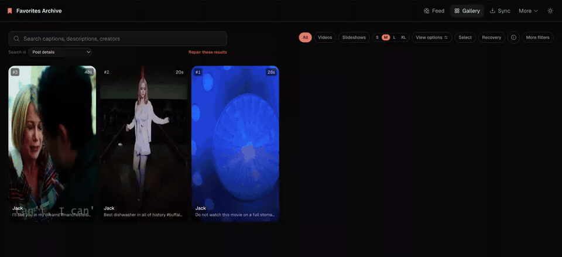
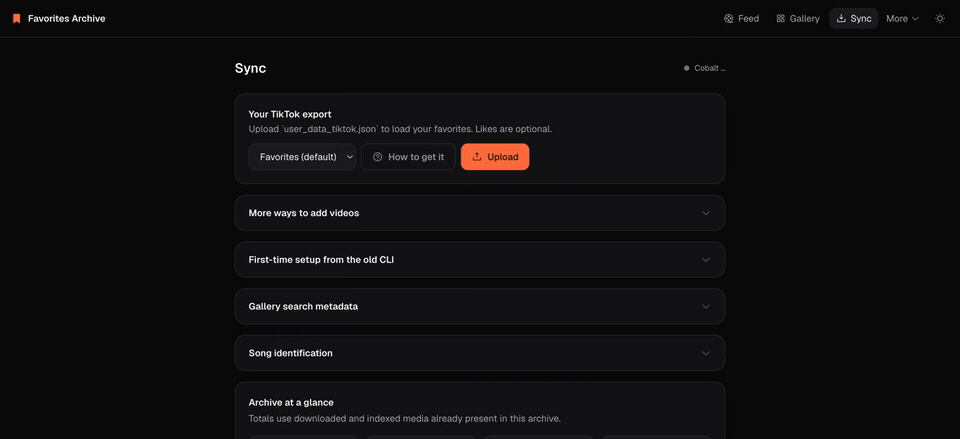
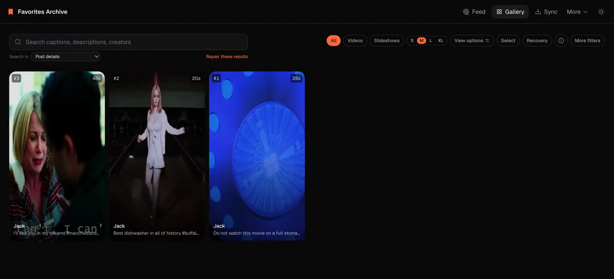

# TikTok Favorites Archive

Save your TikTok favorites, likes, or a creator’s public posts to your own machine. Watch them in a scrollable Feed, search them in Gallery, and keep the files when the original posts disappear.

Already have a myfaveTT archive? Import its MP4s, including copies of posts that are no longer on TikTok.



Recorded from the current app with three of my own edits: Manchester by the Sea, Buffalo ’66, and Mysterious Skin.

## Quick start

Install and start [Docker](https://www.docker.com/). On Windows or macOS, Docker Desktop needs to be running before the next step.

Download this repository with **Code → Download ZIP** on GitHub and extract it, or clone it:

```bash
git clone https://github.com/JackB296/tiktok-favorites-archiver.git
cd tiktok-favorites-archiver
```

In the extracted or cloned project folder, run:

```bash
docker compose up -d
```

Open [localhost:8080](http://localhost:8080). The first launch downloads the prebuilt app and Cobalt images. You do not need to install Python, Node, or FFmpeg separately.

Then choose an import method below. Once videos are available, open **Gallery** to search or **Feed** to watch.

Using **Unraid, CasaOS, or Umbrel**? See the [installation templates](templates/).

## Choose what to import

All three paths start in **Sync**.

| What you have | Where to go | What happens |
| --- | --- | --- |
| A TikTok data export | **Your TikTok export → Upload** | Imports Favorites, Likes, or both. Press **Start sync** to download. |
| A public creator’s username or profile URL | **More ways to add videos → Archive a public username** | Discovers their posts and adds new ones to the archive. |
| A myfaveTT download folder | **More ways to add videos → Import a myfaveTT archive** | Previews matching files, then copies the MP4s into the archive. |



### Favorites and likes

1. In TikTok, request your data in **JSON** format under **Settings and privacy → Account → Download your data**.
2. Download and unzip the export. In this app’s **Sync** page, upload `user_data_tiktok.json`.
3. Choose **Favorites**, **Likes**, or **Favorites + likes**, then press **Start sync**. Favorites are TikTok’s bookmarks.

You can pause and resume a run. Importing the same links again preserves existing archive numbers and completed files.

### A creator’s public posts

Enter `@username` or a profile URL, review the options, and press **Add creator**.

**Start Sync after discovery** and **Keep checking this creator automatically** are both on by default. Turn off automatic checking for a one-time import. Under **Creator rules and automatic enrichment**, you can restrict the backlog to the last 30 days, 90 days, or year, match caption keywords, and skip detected reposts. The default includes the full public backlog.

Public discovery depends on what TikTok makes accessible. Private, removed, or region-restricted posts may not be available.

### Existing myfaveTT files

Choose the myfaveTT root folder, check the preview, and press **Import**. The preview separates files ready to import from files already archived.

Matching uses each TikTok video ID. A saved MP4 can fill an existing unavailable slot even if TikTok has deleted the post. Unmatched MP4s become local-only items. Existing captions, source links, and archive numbers are preserved; the source folder is left untouched. [Supported folder layouts](USER_GUIDE.md#getting-your-tiktok-data).

## Watch and find things



- **Feed:** scroll through videos and photo carousels. Use the arrow keys to move, Space to pause, M to mute, and F for fullscreen.
- **Gallery:** search captions, creators, and hashtags. **Search in** can also target saved comments, identified songs, or local transcripts and on-screen text. Click a creator or hashtag to browse its posts.
- **More:** open Local Lens, Music, Stats, Memories, curation tools, Storage, or Backups when you need them.

Photo posts retain their images for the carousel and are also rebuilt as MP4 slideshows. The app tries to recover the original sound; if it must substitute the fallback track, it records that fact. Videos use Cobalt with a bundled `yt-dlp` fallback for failed or silent results.

Downloads keep stable filenames such as `147.mp4`. Point Plex, Jellyfin, or Kodi at `./downloads`; media-server sidecars can supply titles and artwork. [Full feature guide](USER_GUIDE.md#the-app).

## Using a small drive

The app does **not** currently offer a total storage budget or a “download only three videos” control. A creator’s date filter limits the backlog by age, not by file size.

1. Put `./downloads` on a drive with room before importing a large library, or [configure a mounted storage location](USER_GUIDE.md#configuration).
2. For a small creator trial, turn off **Start Sync after discovery** and automatic checking, then set a short backlog window before adding the creator. Review what was added before starting Sync.
3. To reduce background CPU work, remove **Local analysis** from **Sync → Maintenance & settings → Sync pipeline**. You can run **Local Lens → Analyze missing** later. Song identification is already off by default.
4. To free local media space, use **More → Storage**. **Move** previews the work and verifies the external copy before removing local files. Backups need additional room, especially when they include media.

Docker images, the database, thumbnails, source images, and replacement backups use space too. The per-file download cap is not a limit on the whole archive.

## Updating and troubleshooting

Pull the latest repository changes, then run:

```bash
docker compose pull
docker compose up -d
```

Keep the same downloads folder and `archive-data` volume. If you used an older version that stored the database in `./appdata`, follow the [database migration steps](USER_GUIDE.md#moving-an-existing-database-onto-the-named-volume) before upgrading.

| Problem | First thing to check |
| --- | --- |
| Docker commands cannot connect | Start Docker Desktop or the Docker service. |
| The page will not open | Run `docker compose ps`, then `docker compose logs app`. The first image download may still be in progress. |
| Sync says Cobalt is unreachable | Check `docker compose logs cobalt`. |
| Some downloads failed | Open **Gallery → Recovery** to review missing, failed, and pending items. |
| A saved video has no sound | Open **Sync → Maintenance & settings → Silent-video repair**. |

## Access from other devices (LAN, Tailscale, reverse proxy)

The app has no login and binds to localhost by default. For a phone or another computer, follow the [remote-access setup](USER_GUIDE.md#access-from-other-devices-lan-tailscale-reverse-proxy). Keep the app behind a trusted network or an authenticated proxy.

Your archive stays on your machine. Downloading and metadata retrieval contact TikTok and its media hosts. Local Lens runs locally. Optional song identification sends audio clips to Shazam; Spotify export contacts Spotify when you connect and push a playlist.

## Reference

[User guide](USER_GUIDE.md) · [Configuration](USER_GUIDE.md#configuration) · [Changelog](CHANGELOG.md)

Not affiliated with TikTok or ByteDance. Archive content you are entitled to save and respect the creators’ rights. [Full disclaimer](USER_GUIDE.md#disclaimer). Licensed under [MIT](LICENSE).
